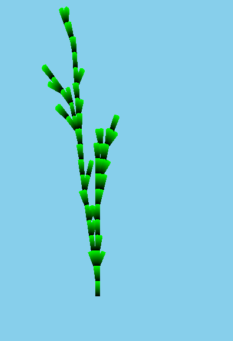
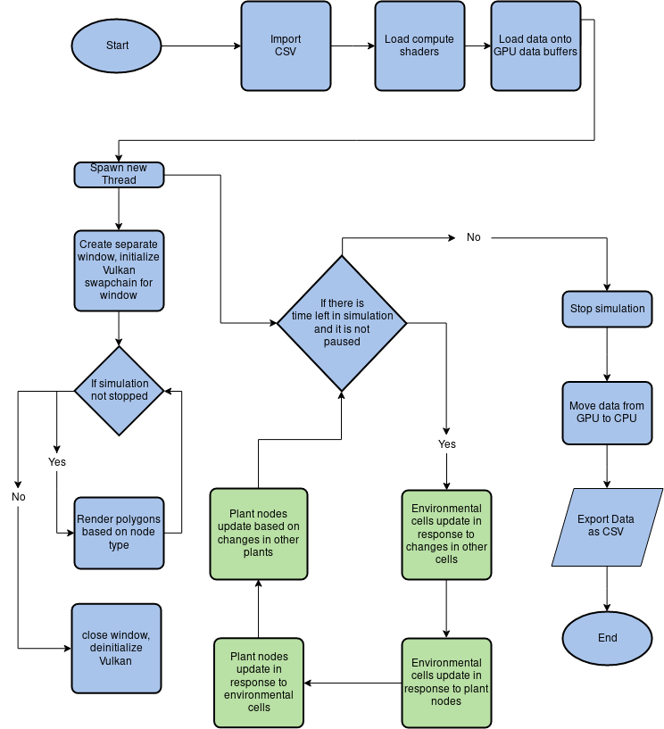

# Compugenesis

CompuGenesis is a simulation framework that uses L-Systems to model plants efficiently and accurately. 

## Goals:
  * Create a flexible plant simulation and paired microclimate implementation that uses the parallelizable capabilities of a GPU.
  * Use the L-System implementation to simulate plant topology within a 95% confidence interval (CI) for actual plant dimensions.
  * Simulate plant topology in response to temperature, soil moisture, and sunlight.

## Status:
  * Plant node simulation on CPU complete
  * Starting work on porting algorithm to GPU
## Todo
  * Decide how best to avoid data races while effectively parallelizing plant interactions
    * 4 Stage interaction cycle 
    * Alternatively, Create seperate step for each function that must be performed
      * Water
      * Sunlight
      * Node Updates

